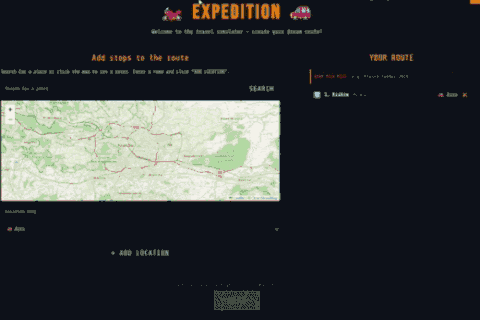

# 🏍️ Expedition 🚗

Expedition is a sleek, single-page application (SPA) designed for travelers, motorcyclists, and road-trip enthusiasts. It doesn't just plan your route — it brings your journey to life through dynamic animations, while keeping a sharp eye on your fuel budget across different borders.



---

## ✨ Key Features

- **Smart Planning** — Add stops via search or by clicking directly on the map. Reorder your journey with drag & drop.
- **Name Your Tour** — Give your expedition a custom name (e.g. *Alpine Summer 2026*) that appears in the header, GPX metadata, and exported videos.
- **Dynamic Route Animation** — Watch your journey unfold in real time. Control the vehicle speed (¼× to 32×) and visualize the path before you even hit the road.
- **Fuel & Cost Calculator** — Input your fuel consumption and local gas prices per country to get a precise estimate of your trip's expenses.
- **Automated Ferry Detection** — The system intelligently identifies sea crossings from OSRM routing data and automatically excludes them from fuel calculations.
- **GPX Export** — Download your full route as a `.gpx` file with waypoints, track data, and metadata. Import directly into Garmin, Google Maps, OsmAnd, Komoot, and more.
- **Video Export** — Record an animated replay of your route as a `.webm` video. Choose from three layouts:
  - 🖥️ **Full HD** (1920×1080) — for YouTube and desktop
  - 🟥 **Instagram** (1080×1080) — square format for posts
  - 📱 **TikTok** (1080×1920) — vertical format for Reels & TikTok
- **Advanced Video Settings** — Fine-tune your export with camera zoom control, map style (Dark or OSM), toggleable stats overlay, and an optional watermark.
- **Bilingual UI** — Switch between English and Polish at any time.

> **⚠️ Video Export Note:** Keep the Expedition tab active and visible during the entire recording process. Switching to another browser tab will cause the animation to throttle, resulting in frame drops, stuttering, or gaps in the exported video.

---

## 🚀 Getting Started

No build step required — Expedition runs entirely in the browser using vanilla JS modules.

1. Clone the repository:
   ```bash
   git clone https://github.com/filipok3101/Expedition.git
   cd Expedition
   ```

2. Serve the project with any local HTTP server (required for ES modules):
   ```bash
   # Using VS Code → install the "Live Server" extension and click "Go Live"
   # Or using Node.js:
   npx serve .
   # Or using Python:
   python -m http.server 8080
   ```

3. Open `http://localhost:8080` (or the port your server uses) in your browser.

> ⚠️ Opening `index.html` directly via `file://` will not work due to ES module restrictions.

---

## 🗺️ How It Works

1. **Map Your Route** — Pick your start, end, and all the "must-see" spots in between. Search by name or click the map. Give your tour a name.
2. **Configure Your Ride** — Set fuel consumption for each vehicle type and current fuel prices per country.
3. **Analyze** — Review total distance, ferry segments, fuel usage, and estimated costs.
4. **Relive** — Run the animation and watch your route come to life.
5. **Export** — Download your route as GPX or record an animated video to share on social media.

---

## 🛠️ Tech Stack

- **Frontend:** Vanilla JavaScript (ES6 modules), HTML5, CSS3
- **Maps & Routing:** [Leaflet](https://leafletjs.com/) + [OSRM](http://project-osrm.org/)
- **Geocoding:** [Nominatim](https://nominatim.org/) + [BigDataCloud](https://www.bigdatacloud.com/) (reverse geocoding)
- **Video Export:** `MediaRecorder` API + `canvas.captureStream` (Chrome/Edge)
- **Map Tiles:** [OpenStreetMap](https://www.openstreetmap.org/) + [CartoDB Dark](https://carto.com/basemaps/) (for video export)

---

## 📁 Project Structure

```
Expedition/
├── index.html                 # Main HTML — three-screen SPA
├── style.css                  # All styles (setup, simulation, export panel, modals)
├── js/
│   ├── main.js                # Entry point, map init, controls, export panel wiring
│   ├── state.js               # Single source of truth — all shared mutable state
│   ├── setup.js               # Route setup screen (search, map clicks, drag & drop)
│   ├── routing.js             # OSRM route fetching, ferry detection, segment building
│   ├── animation.js           # requestAnimationFrame loop for live map animation
│   ├── translations.js        # EN/PL string lookup
│   ├── export.js              # Barrel re-export for export modules
│   └── export/
│       ├── config.js          # Layout dimensions, tile providers, recording settings
│       ├── gpx.js             # GPX file generation and download
│       ├── video.js           # MediaRecorder-based video recording loop
│       ├── video-renderer.js  # Canvas drawing: tiles, routes, vehicle, HUD
│       └── utils.js           # Mercator math, geo helpers, download utilities
├── assets/
│   └── demo.gif               # App demo animation
├── CLAUDE.md                  # Developer guide for AI-assisted coding
├── LICENSE                    # MIT License
├── README.md                  # Documentation (English)
└── README-PL.md               # Dokumentacja (Polski)
```

---

## 🗺️ Roadmap

Future updates will include a migration to the [Valhalla](https://github.com/valhalla/valhalla) routing engine to unlock:

- [ ] **Scenic Routing** — A "motorcycle mode" to prioritize curvy roads and avoid highways
- [ ] **Advanced Avoidance** — Skip ferries, tolls, or specific regions with one click
- [x] **Export & Share** — ~~Download your route as a `.gpx` file or export the animation as a video~~ ✅ Shipped!
- [ ] **Journey Storytelling** — Attach photos to specific stops that pop up during the animation
- [ ] **Global Reach** — Expanded map data for regions worldwide

---

## 🤝 Contributing

This project is open source and thrives on community feedback.

- ⭐ **Star this repo** — it helps the project grow and reach more travelers
- 🐛 **Open an Issue** — found a bug or have a feature idea? [Let me know](https://github.com/filipok3101/Expedition/issues)
- ☕ **Buy me a coffee** — if Expedition helped you plan your next adventure, [consider supporting development](https://buymeacoffee.com/filipok3101)

---

## 📄 License

Distributed under the MIT License. See [LICENSE](LICENSE) for more information.

---

*Created with ❤️ by [Filipok3101](https://github.com/filipok3101) for the global traveling community.*

🇵🇱 [Dostępna jest również Polska wersja dokumentacji (README-PL.md)](README-PL.md)